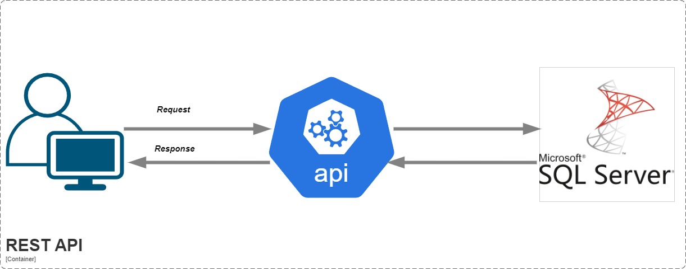

# **.NET Template – REST API**  

A **production-ready** REST API template built with **.NET**.  

## 🚀 Tech Stack  
- **ASP.NET Core (C#)**  
- **SQL Server**  
- **Prometheus & Grafana**  
- **Seq for Logging**  

## 📌 Features  
✔ User Management  
✔ Product & Category Management  
✔ Supplier Management  
✔ Image Uploads  
✔ Import (CSV) & Export (PDF, XLSX, CSV)  
✔ JWT Authentication  

## 🏗 Architecture  
  

## 🛠 Getting Started  
### **Prerequisites**  
- .NET 7+  
- SQL Server  
- Docker (for Grafana & Prometheus)  

### **Installation**  
1️⃣ **Clone the repository:**  
   ```sh
   git clone https://github.com/ortizdavid/Dotnet_Templates.git
   cd TemplateApi/TemplateApi
   ```  
2️⃣ **Configure the app:**  
   Update `appsettings.json` with your database connection string.  

3️⃣ **Install dependencies:**  
   ```sh
   dotnet restore
   ```  
4️⃣ **Set up the database:**  
   ```sh
   dotnet ef database update
   ```  
5️⃣ **Run the API:**  
   ```sh
   dotnet run
   ```  
6️⃣ **Import Postman collections:**  
   API docs are available in `_Api_Collections` inside **Docs**.  

✅ Ensure **Docker, SQL Server, Prometheus, and Grafana** are running.  
✅ API is accessible at `http://127.0.0.1:5050`.  
✅ Test endpoints using **Postman**.  

