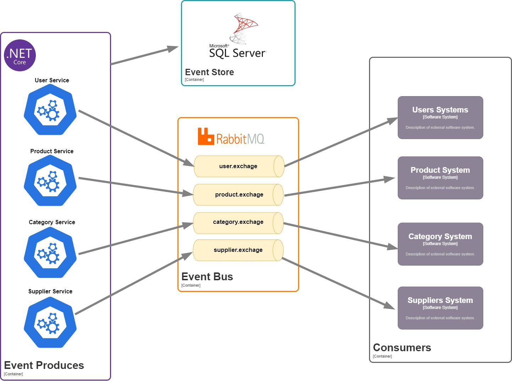

# **.NET Template - Event-Driven Architecture**  
A **template** for building event-driven applications using a **CQRS-based** architecture.

## 🚀 **Tech Stack**  
- **ASP.NET Core Web API** (C#)  
- **SQL Server** (Event Store & Database)  
- **RabbitMQ** (Message Broker)  

## 📌 **Features**  
This template provides a structured approach for managing:  
✔ **User Management**  
✔ **Product Management**  
✔ **Category Management**  
✔ **Supplier Management**  

## 🏗 **Architecture**  
The system follows a **loosely coupled** event-driven design:  

  

## 📖 **How It Works**  
1️⃣ **Producers (Services)** generate events (e.g., user created, product updated).  
2️⃣ **RabbitMQ (Event Bus)** routes events to relevant exchanges.  
3️⃣ **Consumers** process events asynchronously and update external systems or databases.  
4️⃣ **SQL Server (Event Store)** logs events for traceability.  

## 📦 **Getting Started**  
### **Prerequisites**  
- .NET 7+  
- Docker (for RabbitMQ & SQL Server)  
- RabbitMQ Management Plugin enabled  


## 🛠 **Setup & Installation**  

### **1️⃣ Clone the Repository**  
```bash
git clone https://github.com/your-username/your-repository.git
cd your-repository
```

### **2️⃣ Configure the Database**  
Ensure you have **SQL Server** running. You can either:  
- Use a **local SQL Server instance**  
- Start a **Docker container** with SQL Server:  

```bash
docker run -e 'ACCEPT_EULA=Y' -e 'SA_PASSWORD=YourPassword123' \
  -p 1433:1433 --name sqlserver -d mcr.microsoft.com/mssql/server:latest
```

> **Update the connection string** in `appsettings.json`:  
```json
"ConnectionStrings": {
  "DefaultConnection": "Server=localhost,1433;Database=YourDatabase;User Id=sa;Password=YourPassword123;"
}
```

### **3️⃣ Start RabbitMQ**  
Run RabbitMQ via Docker:  
```bash
docker run -d --hostname rabbitmq \
  -p 5672:5672 -p 15672:15672 \
  --name rabbitmq rabbitmq:3-management
```
> Access RabbitMQ **Management UI** at: [http://localhost:15672](http://localhost:15672)  
> **Default credentials:**  
> - **User:** `guest`  
> - **Password:** `guest`  

### **4️⃣ Apply Database Migrations**  
Run EF Core migrations to set up the schema:  
```bash
dotnet ef database update
```

### **5️⃣ Run the Application**  
```bash
dotnet run
```

### **6️⃣ Verify Everything is Running**  
✅ SQL Server is running  
✅ RabbitMQ is running  
✅ The API is accessible at `http://localhost:5112` 

