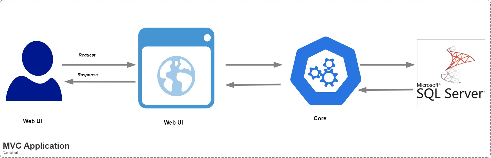

# **.NET Template – MVC Application**  

A **production-ready** MVC template built with **.NET**, featuring session management and role-based access control.  

## 🚀 Tech Stack  
- **ASP.NET Core MVC (C#)**  
- **SQL Server**  
- **Entity Framework Core**  
- **Razor Views**  
- **Session Management**  
- **Bootstrap & jQuery**  

## 📌 Features  
✔ User Management  
✔ Role-Based Access Control (RBAC)  
✔ Session Management (User Authentication & State Tracking)  
✔ Product & Category Management  
✔ Supplier Management  
✔ Image Uploads  
✔ Import (CSV) & Export (PDF, XLSX, CSV)  

## 🏗 Architecture  
  

## 🛠 Getting Started  
### **Prerequisites**  
- .NET 7+  
- SQL Server  

### **Installation**  
1️⃣ **Clone the repository:**  
   ```sh
   git clone https://github.com/ortizdavid/Dotnet_Templates.git
   cd TemplateMvc/TemplateMvc
   ```  
2️⃣ **Configure the app:**  
   Update `appsettings.json` with your database connection string.  

3️⃣ **Install dependencies:**  
   ```sh
   dotnet restore
   ```  
4️⃣ **Set up the database:**  
   ```sh
   dotnet ef database update
   ```  
5️⃣ **Run the application:**  
   ```sh
   dotnet run
   ```  
6️⃣ **Access the application:**  
   Open a browser and go to `http://127.0.0.1:5078`.  

✅ Ensure **SQL Server** is running.  
✅ Sessions will track user login state and maintain user authentication across requests.  
✅ Test the application by logging in, managing users, and performing CRUD operations.  

