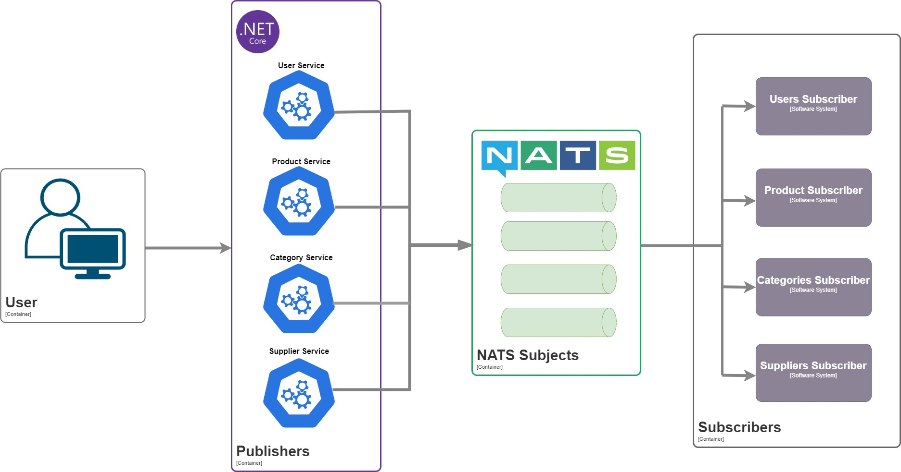

# **.NET Template - Event-Driven Architecture with NATS**  
A **template** for building event-driven applications using a simple architecture with **NATS** as the message broker.  

## 🚀 **Tech Stack**  
- **ASP.NET Core Web API** (C#)  
- **SQL Server** (Database)  
- **NATS** (Message Broker)  

## 📌 **Features**  
This template provides a structured approach for managing:  
✔ **User Management**  
✔ **Authentication & Authorization**  
✔ **Event Publishing & Subscription**  
✔ **Secure Connection to NATS**  

## 🏗 **Architecture**  
The system follows a **loosely coupled** event-driven design:  

  

## 📖 **How It Works**  
1️⃣ **Producers (Services)** generate events (e.g., user created, order placed).  
2️⃣ **NATS (Event Bus)** routes messages to relevant subjects.  
3️⃣ **Consumers (Subscribers)** process events asynchronously and update external systems or databases.  
4️⃣ **SQL Server** stores application data.  

## 📦 **Getting Started**  
### **Prerequisites**  
- .NET 7+  
- Docker (for SQL Server & NATS)  
- NATS Server running  

## 🛠 **Setup & Installation**  

### **1️⃣ Clone the Repository**  
```bash
git clone https://github.com/your-username/TemplateNatsApi.git
cd TemplateNatsApi
```

### **2️⃣ Configure the Database**  
Ensure you have **SQL Server** running. You can either:  
- Use a **local SQL Server instance**  
- Start a **Docker container** with SQL Server:  

```bash
docker run -e 'ACCEPT_EULA=Y' -e 'SA_PASSWORD=YourPassword123' \
  -p 1433:1433 --name sqlserver -d mcr.microsoft.com/mssql/server:latest
```

> **Update the connection string** in `appsettings.json`:  
```json
"ConnectionStrings": {
  "DefaultConnection": "Server=localhost,1433;Database=nats_api;User Id=sa;Password=YourPassword123;"
}
```

### **3️⃣ Start NATS Server**  
Run NATS via Docker:  
```bash
docker run -d --name nats -p 4222:4222 -p 8222:8222 nats:latest
```
> Access NATS **Monitoring UI** at: [http://localhost:8222](http://localhost:8222)  

### **4️⃣ Apply Database Migrations**  
Run EF Core migrations to set up the schema:  
```bash
dotnet ef database update
```

### **5️⃣ Run the Application**  
```bash
dotnet run
```

### **6️⃣ Verify Everything is Running**  
✅ SQL Server is running  
✅ NATS Server is running  
✅ The API is accessible at `http://localhost:5112`  

